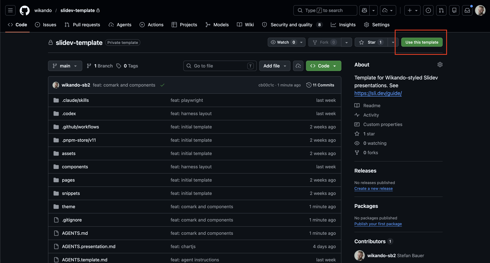
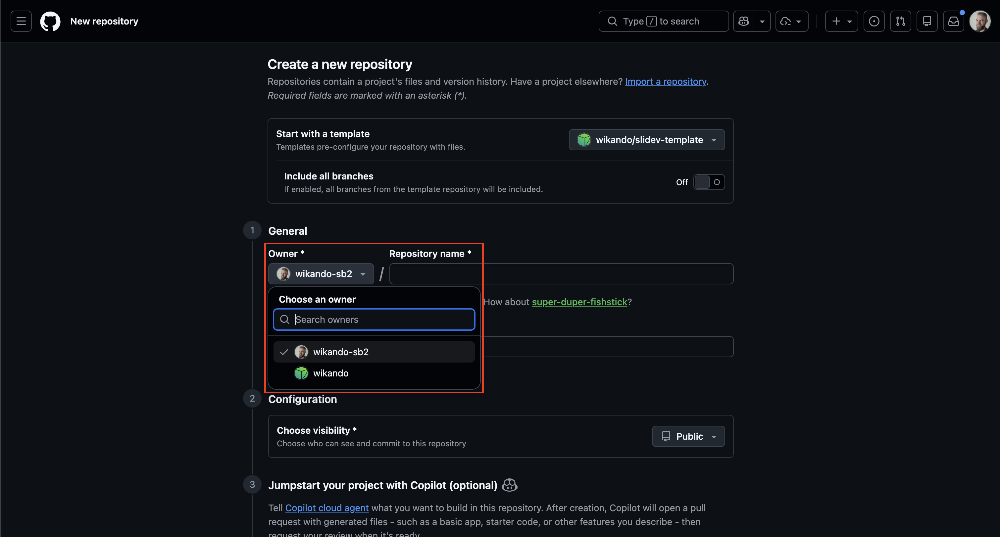
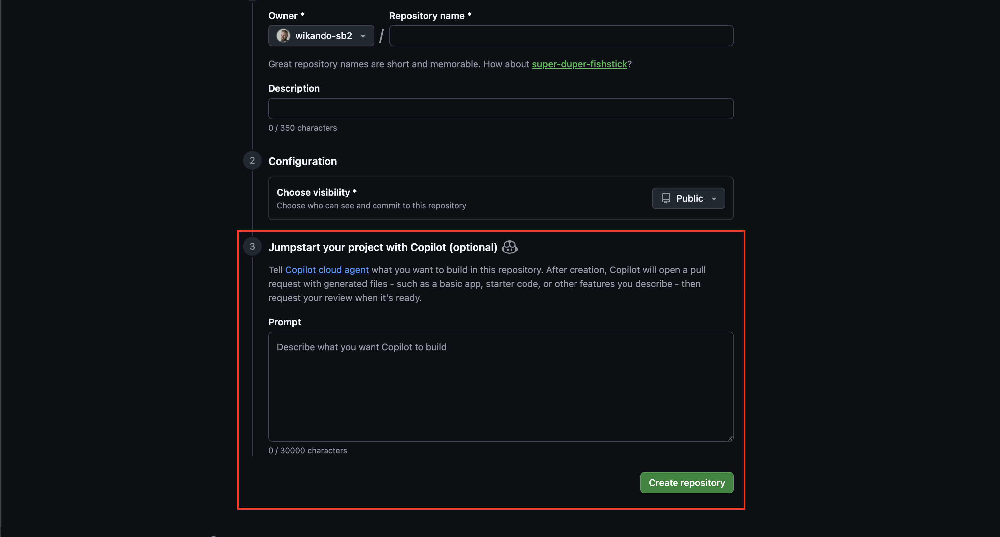

# FundraisingBox Slidev Template

[](https://github.com/wikando/slidev-template/actions/workflows/ci.yml)

This repository contains a local Slidev theme for Wikando/FundraisingBox presentations. The theme lives in `theme/` and
is referenced from `slides.md` with `theme: ./theme`.

## Quickstart

### Step 1: Do not clone, do not fork: Use the template button



You could, of course clone or fork the repo, but it's much easier to use the template button at the
top of this repositories' GitHub page. It creates a new repository with the same structure and files,
but without the commit history.

[Click here to see an example.](https://github.com/wikando/slidev-preview-video/commits/main/)

### Step 2: Select the correct owner



Remember to select the correct owner. If this is an _official Wikando presentation_, e.g. retreat
content that should be consumable by anyone in the company, select the Wikando organization.
If this is a _personal presentation_, e.g. an IT meeting demo, select your own GitHub account.

The naming convention for presentation repositories is `presentation-<event-or-topic>-<presentation-name>`.
For example, `presentation-retreat-2026-some-topic`.

### Step 3: Use an initial Copilot prompt to kickstart your presentation



This step is optional.

You can use your own notes, a ticket, or a detailed instruction as initial Copilot prompt.
This will create a pull request with some initial slides and content. The styling and
content can be surprisingly good, and it gives you a nice starting point for your presentation.

[Click here to see an example.](https://github.com/wikando/slidev-preview-video/pull/1)

## Install

```bash
make install
```

Dependencies are installed through Docker with pnpm, so local Node.js or pnpm installations are not required.

## Run

```bash
make dev
```

The dev server starts at <http://localhost:3000> by default. Set `SLIDEV_PORT=3031` in `.env.local`
for personal port choices when multiple presentations run in parallel. If the selected port is busy,
Make checks the next ports and prints the final local URL before Docker starts.

## Build

```bash
make build
```

`make build` creates a static site in `dist/`.

## Format

```bash
make format
make format-check
```

## Customize Slides

- Edit `slides.md` for the main deck content.
- Add reusable slide sections in `pages/` and import them with `src`.
- Add TypeScript examples in `snippets/` and import them with Slidev snippet syntax.
- Add interactive Vue examples in `components/` and use them directly in slides.
- Use theme components for recurring patterns: `ThemeAgenda`, `ThemeAgendaItem`, `ThemeLead`, `ThemeMetricStack`,
  `ThemeMetricStackItem`, `ThemeShowcase`, and `ThemeButton`.

### Hand-drawn annotations

Wrap inline text or an inline element with `NeatAnnotation`:

```md
<NeatAnnotation note="Review this" direction="n" color="red">
  release date
</NeatAnnotation>

<NeatAnnotation color="amber">important text</NeatAnnotation>
```

`note` adds an arrow and label; omit it for a marker only. `direction` is the direction the arrow points
(`n`, `ne`, `e`, `se`, `s`, `sw`, `w`, `nw`), so `n` places the label below the target. Colors are `amber`,
`blue`, `green`, `red`, `purple`, and `rainbow`; omit `color` for warm gray. `no-mark` removes the target
highlight. For example, use `style="--ann-color: #00c2d7; --ann-label-max-width: 220px"` for custom color
and label width. The upstream `--ann-target-gap`, `--ann-label-gap`, `--ann-lower-label-gap`,
`--ann-arrow-x`, `--ann-arrow-y`, `--ann-text-x`, `--ann-text-y`, and `--ann-rotate` variables are also
available. Leave space around the target for its absolute-positioned label.

The component bundles its CSS and Shantell Sans font locally; decks that do not use it do not include
either asset. See [component sources and licenses](components/NeatAnnotation/README.md).

## Comark Syntax

`slides.md` enables Slidev Comark syntax by default with `comark: true`.
It's highly useful when working with Slidev. Learn more about Comark [here](https://comark.dev/).

## Local Theme Structure

```txt
theme/
  package.json
  styles/
    index.ts
    tokens.css
    layouts.css
    code.css
  layouts/
    cover.vue
    default.vue
    center.vue
  components/
    ThemeAgenda.vue
    ThemeAgendaItem.vue
    ThemeButton.vue
    ThemeFooter.vue
    ThemeLead.vue
    ThemeMetricStack.vue
    ThemeMetricStackItem.vue
    ThemeShowcase.vue
```

Configure the footer from `slides.md`:

```yaml
themeFooter:
  text: Wikando Slidev Template
```

The theme uses Montserrat for sans text, Source Code Pro for code, FundraisingBox green/lime gradients for covers,
branded pill buttons, dense agenda lists, and light/dark color tokens.
